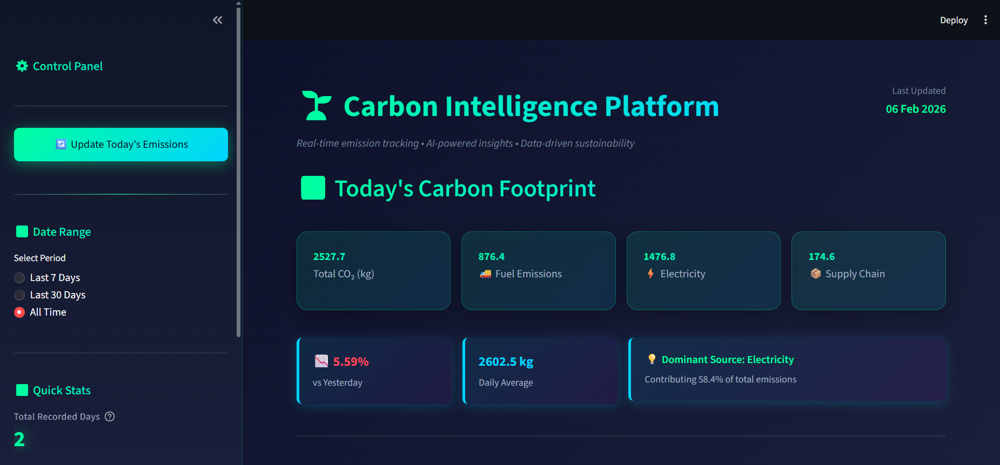

# Carbon Copilot – Enterprise Carbon Intelligence Platform

> An Agentic-AI sustainability intelligence system that transforms carbon accounting from reactive reporting to proactive optimization.



## Executive Summary

**Carbon Copilot** is an enterprise-grade platform combining:
- Automated emission measurement
- Retrieval-Augmented Generation (RAG)
- LLM-powered reasoning
- Company-specific sustainability insights

**Key Innovation**: Leverages **Model Context Protocol (MCP)** for synthetic data generation, enabling comprehensive testing without sensitive production data access.

---

## Table of Contents

- [Executive Summary](#executive-summary)
- [Project Objective](#project-objective)
- [Problem Statement](#problem-statement)
- [System Architecture](#system-architecture)
- [Technical Implementation](#technical-implementation)
- [Key Features](#key-features)
- [Installation and Deployment](#installation-and-deployment)
- [Project Impact](#project-impact)
- [Future Development](#future-development)
- [Technical Documentation](#technical-documentation)
- [License](#license)
- [Contact and Contribution](#contact-and-contribution)

---

---

## Project Objective

### Mission Statement

Build an AI-powered enterprise sustainability intelligence system that enables organizations to automatically **measure**, **analyze**, and **reduce** daily carbon emissions.

### Core Capabilities

| Capability | Description |
|------------|-------------|
| **Automated Measurement** | Daily carbon footprint calculation across all operational activities |
| **Context-Aware Analysis** | Leverages company-specific knowledge bases via RAG |
| **Actionable Insights** | Grounded recommendations considering organizational constraints |
| **Decision Support** | Data-driven guidance for emissions reduction and cost optimization |

### Target Users

- Small to mid-sized enterprises (SMEs)
- Corporate sustainability teams
- ESG & operations managers
- Environmental compliance officers

### Design Philosophy

> **Separation of Computation and Reasoning**  
> Carbon calculations remain deterministic and fact-based, while AI reasoning operates on validated outputs to generate strategic insights.

**Why This Matters**: Ensures numerical accuracy while leveraging LLM capabilities for contextual analysis and recommendation generation.

### Goal Achievement

Replace manual spreadsheets and generic calculators with intelligent, company-specific decision support that directly lowers emissions and operational costs.

---

## Problem Statement

### Current Industry Challenges

Organizations face systemic barriers in operationalizing sustainability:

#### 1. **Data Fragmentation**
- Emission data scattered across multiple systems (energy, fleet, procurement)
- No centralized visibility or unified dashboard
- Manual data collection from disparate sources

#### 2. **Manual & Slow Processes**
- Periodic manual carbon accounting (quarterly/annually)
- Spreadsheet-based calculations prone to errors
- No real-time monitoring or rapid response capability

#### 3. **Generic & Ineffective Guidance**
- Off-the-shelf tools provide standardized recommendations
- Fail to account for company-specific constraints
- Ignore operational context and strategic priorities

#### 4. **Compliance Overhead**
- Significant manual effort for ESG reporting
- Time-consuming data aggregation and validation
- Difficulty demonstrating progress and impact

### Our Solution

**Carbon Copilot** addresses these challenges through:

**Automated Data Integration** – Unified operational data capture  
**Continuous Tracking** – Daily emission monitoring and analysis  
**Context-Aware AI** – RAG-powered company-specific recommendations  
**Business Intelligence** – Enterprise-grade dashboards and reporting

---

## System Architecture

### High-Level Architecture

```
┌─────────────────────────────────────────────────────────────┐
│                    Data Ingestion Layer                      │
│  ┌──────────────────────────────────────────────────────┐   │
│  │   MCP Server (Model Context Protocol)                │   │
│  │   Synthetic Data Generation:                         │   │
│  │   - Energy consumption patterns                      │   │
│  │   - Fuel usage across fleet operations               │   │
│  │   - Supply chain activity simulation                 │   │
│  └──────────────────────────────────────────────────────┘   │
└─────────────────────┬───────────────────────────────────────┘
                      │
┌─────────────────────▼───────────────────────────────────────┐
│                  Computation Engine                          │
│  ┌──────────────────────────────────────────────────────┐   │
│  │   Carbon Calculation Engine                          │   │
│  │   - Emission factor database                         │   │
│  │   - Activity-to-CO₂ conversion algorithms            │   │
│  │   - Temporal aggregation & normalization             │   │
│  └──────────────────────────────────────────────────────┘   │
└─────────────────────┬───────────────────────────────────────┘
                      │
┌─────────────────────▼───────────────────────────────────────┐
│                   Persistence Layer                          │
│  ┌──────────────────────────────────────────────────────┐   │
│  │   SQLite Database (SQLAlchemy ORM)                   │   │
│  │   - Daily emission records                           │   │
│  │   - Historical trend data                            │   │
│  │   - UPSERT-safe operations                           │   │
│  └──────────────────────────────────────────────────────┘   │
└─────────────────────┬───────────────────────────────────────┘
                      │
┌─────────────────────▼───────────────────────────────────────┐
│              Intelligence Layer (RAG Pipeline)               │
│  ┌──────────────────────────────────────────────────────┐   │
│  │   Knowledge Base                                     │   │
│  │   - Company policies & procedures                    │   │
│  │   - Fleet specifications & constraints               │   │
│  │   - Sustainability goals & targets                   │   │
│  └──────────────────────────────────────────────────────┘   │
│  ┌──────────────────────────────────────────────────────┐   │
│  │   Vector Database (FAISS)                            │   │
│  │   - Semantic search capabilities                     │   │
│  │   - Document embeddings (Sentence Transformers)      │   │
│  └──────────────────────────────────────────────────────┘   │
└─────────────────────┬───────────────────────────────────────┘
                      │
┌─────────────────────▼───────────────────────────────────────┐
│                 Reasoning Layer                              │
│  ┌──────────────────────────────────────────────────────┐   │
│  │   Gemini LLM Agent                                   │   │
│  │   - Context-aware recommendation engine             │   │
│  │   - Emission trend analysis                          │   │
│  │   - Strategy generation                              │   │
│  └──────────────────────────────────────────────────────┘   │
└─────────────────────┬───────────────────────────────────────┘
                      │
┌─────────────────────▼───────────────────────────────────────┐
│               Presentation Layer                             │
│  ┌──────────────────────────────────────────────────────┐   │
│  │   Streamlit Dashboard                                │   │
│  │   - Real-time metrics & KPIs                         │   │
│  │   - Interactive visualizations (Plotly)              │   │
│  │   - AI-generated insights                            │   │
│  └──────────────────────────────────────────────────────┘   │
└─────────────────────────────────────────────────────────────┘
```

### 🔄 Data Flow Pipeline

```
Step 1: INGESTION
   ↓
   MCP Server generates synthetic operational data
   (Energy, Fuel, Supply Chain)
   
Step 2: TRANSFORMATION
   ↓
   Carbon Engine applies emission factors
   Activity → CO₂ conversion
   
Step 3: STORAGE
   ↓
   SQLAlchemy ORM persists records
   Temporal indexing & UPSERT operations
   
Step 4: CONTEXTUALIZATION
   ↓
   RAG retrieves company documents
   Operational constraints & policies
   
Step 5: ANALYSIS
   ↓
   Gemini LLM synthesizes data + context
   Generates insights & recommendations
   
Step 6: VISUALIZATION
   ↓
   Streamlit Dashboard renders
   Metrics, Trends, AI Insights
```

### 🔌 Model Context Protocol (MCP) Integration

**Purpose**: Generate realistic synthetic operational data for testing and demonstration.

**MCP Server Capabilities**:

| Data Type | Simulation |
|-----------|------------|
| **Energy Consumption** | Facility electricity with daily/seasonal variations |
| **Fuel Usage** | Fleet operations, vehicle types, mileage patterns |
| **Supply Chain** | Logistics, freight transportation, distribution |

**Advantages**:

- Comprehensive system testing without production data
- Demonstrates full platform capabilities in controlled environment
- Customizable scenarios for different organizational profiles
- Maintains data privacy during development

---

## Technical Implementation

### Technology Stack

#### **Backend & Data**
```
Python 3.9+          │ Core language
FastAPI              │ MCP server implementation  
SQLAlchemy + SQLite  │ ORM & persistence
Pandas               │ Emission calculations
```

#### **AI & Machine Learning**
```
Google Gemini API         │ Generative reasoning
LangChain                 │ RAG orchestration
FAISS                     │ Vector similarity search
Sentence Transformers     │ Document embeddings
```

#### **Frontend & Visualization**
```
Streamlit            │ Interactive dashboard
Plotly               │ Data visualization
```

---

### 📂 Project Structure

```
carbon-copilot/
│
├── 📁 app/
│   ├── 📁 carbon_engine/          # Emission calculation logic
│   │   ├── calculator.py
│   │   └── emission_factors.py
│   │
│   ├── 📁 database/               # Data models & persistence
│   │   ├── models.py
│   │   └── session.py
│   │
│   ├── 📁 ingestion/              # Data collection services
│   │   └── mcp_client.py
│   │
│   ├── 📁 llm_agent/              # AI reasoning components
│   │   ├── agent.py
│   │   └── prompts.py
│   │
│   ├── 📁 rag/                    # Knowledge retrieval system
│   │   ├── build_index.py
│   │   ├── retriever.py
│   │   └── vectorstore.py
│   │
│   └── 📁 mcp_server/             # Mock data server (MCP)
│       └── mock_api.py
│
├── 📁 data/
│   └── 📁 company_docs/           # Knowledge base documents
│
├── 📄 dashboard_app.py            # Main application entry point
├── 📄 requirements.txt
├── 📄 .env.example
├── 📄 .gitignore
└── 📄 README.md
```

---

### 🧠 Intelligent System Design

#### **Retrieval-Augmented Generation (RAG)**

**Knowledge Base Includes**:
- Company sustainability policies & targets
- Fleet composition & operational constraints  
- Historical initiatives & outcomes
- Regulatory requirements & compliance standards

**Benefits**: Prevents generic advice, ensures recommendations are actionable within organizational context.

---

#### **Agent-Based Reasoning**

| Mode | Function |
|------|----------|
| **Analytical** | Examines trends, identifies anomalies, explains causal factors |
| **Strategic** | Generates prioritized recommendations considering feasibility & ROI |

---

#### **Business-Oriented Categories**

**Instead of**: Scope 1/2/3 (Technical taxonomy)  
**We Use**: 
-  Fuel Emissions (Fleet & Equipment)
-  Electricity Emissions (Facilities & Operations)  
-  Supply Chain Emissions (Logistics & Procurement)

**Why**: Aligns with business decision-making and operational responsibilities.

---

## Key Features

### 1. Automated Carbon Accounting
-  Daily emission calculations across operational categories
-  Standardized emission factor database (EPA, DEFRA, IPCC)
-  Historical trend analysis & year-over-year comparisons

### 2. Context-Aware Intelligence
-  Company-specific recommendation engine powered by RAG
-  Constraint-aware strategy generation
-  Impact quantification & prioritization

### 3. Enterprise Dashboard
-  Real-time emission metrics & KPIs
-  Interactive time-series visualizations
-  Category breakdowns & comparative analysis
-  Executive summaries & actionable insights

### 4. Synthetic Data Generation (MCP)
-  Realistic operational activity simulation
-  Configurable scenario modeling
-  Privacy-preserving development environment

### 5. Zero Hardware Dependency
-  Software-only implementation
-  No IoT sensors or monitoring equipment required
-  API integration with existing systems

---

## Installation and Deployment

### Prerequisites

| Requirement | Version |
|-------------|---------|
| Python | 3.9+ |
| Git | Latest |
| Gemini API Key | Required |

---

### 📦 Local Setup

#### **Step 1**: Clone Repository

```bash
git clone https://github.com/Bit-Bard/Carbon_Copilot_Project.git
cd Carbon_Copilot_Project
```

#### **Step 2**: Create Virtual Environment

```bash
# Create virtual environment
python -m venv venv

# Activate (Unix/macOS)
source venv/bin/activate

# Activate (Windows)
venv\Scripts\activate
```

#### **Step 3**: Install Dependencies

```bash
pip install -r requirements.txt
```

#### **Step 4**: Configure Environment

Create `.env` file in project root:

```env
GEMINI_API_KEY=your_api_key_here
```

#### **Step 5**: Initialize RAG Knowledge Base

```bash
python app/rag/build_index.py
```

> This processes company documents and builds the vector index for semantic search.

#### **Step 6**: Start MCP Server

```bash
uvicorn app.mcp_server.mock_api:app --reload --host 0.0.0.0 --port 8000
```

> MCP server begins generating synthetic operational data.

#### **Step 7**: Launch Dashboard

```bash
streamlit run dashboard_app.py
```

> **Access**: Open browser at `http://localhost:8501`

---

### ☁️ Production Deployment

#### Recommended Approaches

| Platform | Use Case |
|----------|----------|
| **Streamlit Cloud** | Free tier hosting |


#### Production Considerations

-  **Database**: Migrate to PostgreSQL for multi-user scenarios
-  **API Gateway**: Implement rate limiting & authentication
-  **Monitoring**: APM and error tracking
-  **Security**: Environment variable management

---

## Project Impact

### Environmental Impact

| Area | Impact |
|------|--------|
| **Granular Visibility** | Daily tracking identifies *when* and *where* emissions occur |
| **Targeted Interventions** | AI pinpoints specific opportunities (fuel efficiency, energy optimization, logistics) |
| **Measurable Progress** | Quantified impact validates green technology investments |
| **Behavioral Change** | Real-time feedback encourages emission-conscious decisions |

### Business Impact

| Metric | Value |
|--------|-------|
| **Cost Reduction** | 10-25% savings in targeted categories (energy, fuel) |
| **ESG Reporting** | 60-80% reduction in reporting overhead |
| **Risk Management** | Early anomaly detection prevents penalties |
| **Strategic Planning** | Data-driven ROI on sustainability investments |

**Additional Benefits**:
- Enhanced ESG performance supports customer acquisition
- Improved investor relations & brand positioning
- Competitive advantage in sustainability-conscious markets

### Technical Contributions

#### Architecture Excellence
✅ Clean separation: data → logic → intelligence → UI  
✅ Modular, composable components  
✅ Production-grade patterns (UPSERT, error handling, logging)

#### AI Engineering Best Practices
✅ Deterministic computation ≠ probabilistic reasoning  
✅ RAG implementation for grounded responses  
✅ Effective prompt engineering  
✅ MCP integration for enterprise data simulation

---

## Future Development

### 🤖 Automation & Scheduling
- [ ] Automated daily data ingestion from production systems
- [ ] Scheduled emission calculations & report generation
- [ ] Alert system for threshold breaches
- [ ] Anomaly detection notifications

### 📄 Reporting Capabilities
- [ ] PDF report generation for ESG disclosures
- [ ] Customizable executive dashboards (role-based views)
- [ ] Integration with sustainability frameworks (GRI, SASB, TCFD)
- [ ] Automated regulatory compliance reports

### 📊 Advanced Analytics
- [ ] What-if scenario modeling for reduction strategies
- [ ] Machine learning for emission forecasting
- [ ] Anomaly detection algorithms
- [ ] Carbon budget tracking & allocation
- [ ] Predictive maintenance for equipment efficiency

### 🏢 Multi-Tenancy & Scalability
- [ ] SaaS architecture for multiple organizations
- [ ] Role-based access control (RBAC)
- [ ] Cloud-native deployment (AWS, Azure, GCP)
- [ ] Horizontal scaling for enterprise workloads
- [ ] Multi-region support

### 🔌 Data Integration
- [ ] ERP system connectors (SAP, Oracle)
- [ ] IoT platform integrations
- [ ] Real-time API connections
- [ ] Custom emission factors support
- [ ] Regional variation handling
- [ ] Renewable Energy Certificate (REC) tracking

### ⚡ Enhanced MCP Capabilities
- [ ] Real-time data streaming from production
- [ ] Advanced scenario generation
- [ ] Multi-source data validation
- [ ] Data quality reconciliation

---

## Technical Documentation

### 🔗 API Reference

**Base URL**: `http://localhost:8000`  
**Documentation**: `http://localhost:8000/docs` (when MCP server is running)

#### Key Endpoints

| Method | Endpoint | Description |
|--------|----------|-------------|
| GET | `/api/v1/activity/energy` | Retrieve energy consumption data |
| GET | `/api/v1/activity/fuel` | Retrieve fuel usage data |
| GET | `/api/v1/activity/supply-chain` | Retrieve supply chain activity |

---

### 🗄️ Database Schema

```python
class DailyEmission(Base):
    __tablename__ = "daily_emissions"
    
    id: Integer              # Primary Key
    date: Date               # Unique Index
    fuel_emissions: Float    # kg CO₂
    electricity_emissions: Float
    supply_chain_emissions: Float
    total_emissions: Float
    created_at: DateTime
    updated_at: DateTime
```

---

### 🧠 RAG Pipeline Configuration

| Parameter | Value |
|-----------|-------|
| **Document Chunking** | 1000 chars (200 char overlap) |
| **Embedding Model** | all-MiniLM-L6-v2 (384 dims) |
| **Vector Store** | FAISS (L2 distance) |
| **Retrieval Strategy** | Top-k similarity (k=3) |
| **Re-ranking** | Contextual relevance scoring |

---

### 📐 Emission Calculation Methodology

**Formula**:
```
CO₂ Emissions = Activity Data × Emission Factor × Conversion Factor
```

**Emission Factor Sources**:
- EPA (Environmental Protection Agency)
- DEFRA (Department for Environment, Food & Rural Affairs)  
- IPCC (Intergovernmental Panel on Climate Change)

**Example Calculation**:
```python
# Diesel fuel consumption
fuel_liters = 100
emission_factor = 2.68  # kg CO₂ per liter
total_emissions = fuel_liters * emission_factor  # 268 kg CO₂
```

---

## License

This project is licensed under the **MIT License**. See [LICENSE](LICENSE) file for details.

---

## Contact and Contribution

### Developer
**Name**: Bit-Bard  
**GitHub**: [@Bit-Bard](https://github.com/Bit-Bard)  
**Repository**: [Carbon Copilot Project](https://github.com/Bit-Bard/Carbon_Copilot_Project)

### Contributing

Contributions are welcome! Here's how you can help:

1. 🍴 Fork the repository
2. 🌿 Create a feature branch (`git checkout -b feature/AmazingFeature`)
3. 💾 Commit your changes (`git commit -m 'Add AmazingFeature'`)
4. 📤 Push to branch (`git push origin feature/AmazingFeature`)
5. 🔁 Open a Pull Request

**Guidelines**:
- Submit pull requests for bugs, features, or documentation improvements
- Open issues for bug reports or feature requests
- Follow existing code style and conventions

---

##  Acknowledgments

This capstone project demonstrates the integration of:

-  Modern AI technologies (LLMs, RAG, vector databases)
-  Domain-specific engineering (carbon accounting, sustainability science)
-  Practical business intelligence systems

**Key Achievement**: Synthesis of software engineering, data science, and environmental science principles applied to real-world organizational challenges.

**Innovation Highlight**: Effective application of **Model Context Protocol (MCP)** for enterprise data simulation, demonstrating how synthetic data generation enables comprehensive system testing in privacy-sensitive domains.

---

##  Citation

If you use this project in research or academic work, please cite:

```bibtex
@software{carbon_copilot_2024,
  title = {Carbon Copilot: An Enterprise Carbon Intelligence Platform},
  author = {Bit-Bard},
  year = {2024},
  url = {https://github.com/Bit-Bard/Carbon_Copilot_Project}
}
```

---
## Special thanks to team members for their constant support throughout these project 
<b> Ayush Singh</b>
<b> Aditya Upadhyaya </b>
## 🌟 Show Your Support

If you find this project valuable:

-  Star this repository
-  Report bugs or suggest features via issues
-  Share with colleagues working on sustainability

---

<div align="center">

**Built with ❤️ for a sustainable future**

[⬆ Back to Top](#carbon-copilot--enterprise-carbon-intelligence-platform)

</div>
